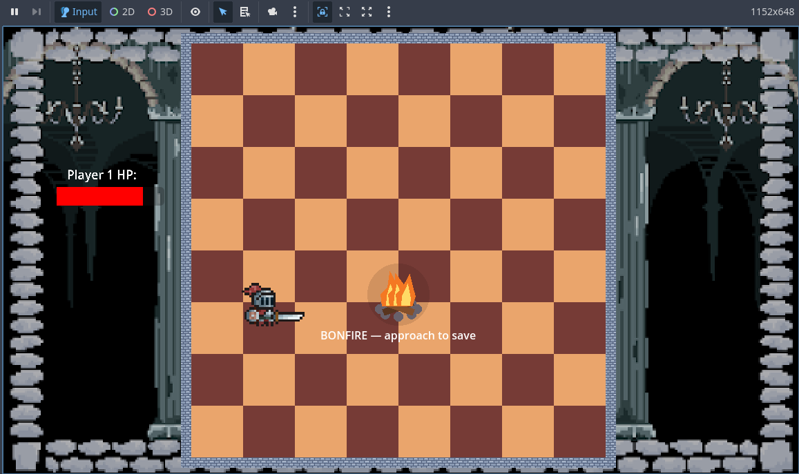

This week was another full week of development for Elemental Dungeon with our Milestone 1 coming up. We needed a fully playtestable version for our first playtest with other people coming up. This week I worked on adding saving and loading with a bonfire after the players defeat the boss. I also created a load button that is currently on the character select screen but can be put on the start screen when it is implemented later down the line.

## Milestone 1

Right now for milestone 1 we have a tutorial boss, one full boss fight, a character select screen, stat menu, and saving and loading for the players.

We have playtest this week and we will be able to use that feedback to make our next steps decision.

