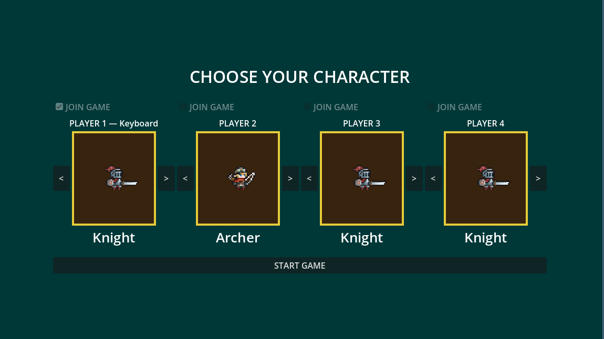

This week was a hard week as far as the learning curve. Implementing the multiplayer and controller support was something I did not have much experience in but after a while I was able to get it fully implemented. I had various different resources that helped me and many helpful videos

This week's estimated time was much less than the actual amount of time spent on the task. I was struggling getting the game to recognize the player and the device input as being separate things because the way it was set up originally player 1 was always keyboard and the other players could be both. But now that does not have to be the case.

Communication within the team has been good and updates are still constant withing the team. The content I have been pushing has been useable and tested before allowing it to make it to the GitHub.

## Controller Support

Added controller support for a wider audience experience
